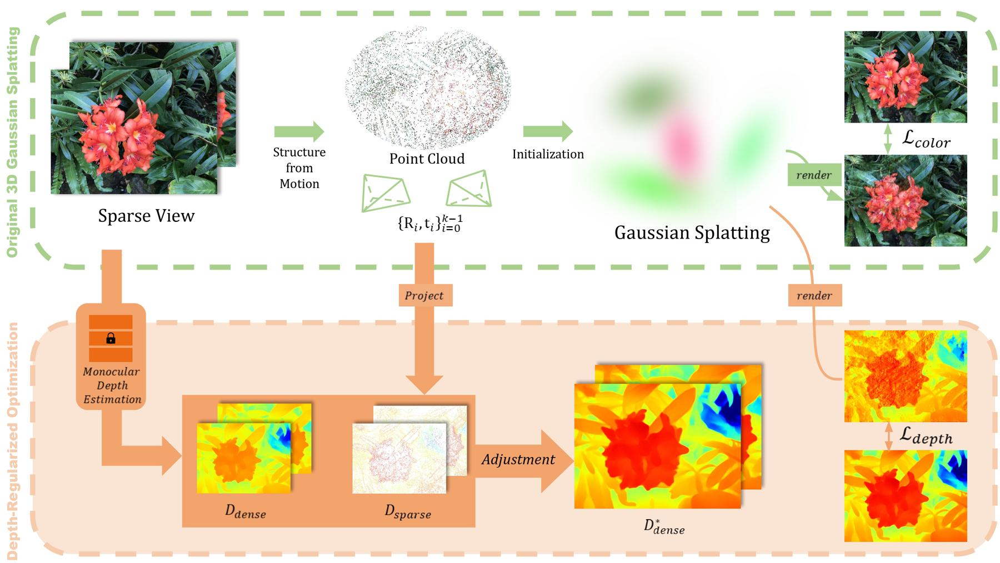

<div align="center"> 

# [CVPRW 2024] DRGS: Depth-Regularized Optimization for 3D Gaussian Splatting in Few-Shot Images
### [Jaeyoung Chung](https://robot0321.github.io/), [Jeongtaek Oh](https://taekkii.github.io/), [Kyoung Mu Lee](https://cv.snu.ac.kr/index.php/~kmlee/)
  
[](https://robot0321.github.io/DepthRegGS/index.html)
[](https://arxiv.org/abs/2311.13398) 



<!--### :warning: Current code corresponds to version v1 as archived in [here](https://arxiv.org/abs/2311.13398v1) except the rasterizer :warning:
#### :construction: We are currently in the process of gradually improving our methods. New code/paper will be updated later :construction: -->

</div>

## Installation
Clone this repository ***recursively*** for submodules: ZoeDepth, simple-knn, rasterizer
~~~bash
git clone https://github.com/robot0321/DepthRegularizedGS.git --recursive
~~~

You can easily install the dependencies with .yml file, or just install the rasterizer only.
**Note:** This rasterizer is an improved version implemented after the submission to arXiv.
~~~bash
## (Option 1) 3DGS dependencies + depth rasterizer
conda env create --file environment.yml
conda activate DepthRegularizedGS

## (Option 2) If you already install the dependencies for 3DGS, just install the new (depth) rasterizer and pytorch3d
pip install -e submodules/diff-gaussian-rasterization-depth-acc
pip install pytorch3d
~~~


## Dataset Preparation (+ able to apply on your own data)
We randomly select the train/test set as described in the paper. 
(**Note:** Our scripts will generate some files/folders in the dataset folder. If you want to not disturb the original dataset, use the copy of the dataset.)

🍀 You can just download the preprocessed dataset in this [link](https://drive.google.com/file/d/1iJW4zfIXBAqQc87gdb4V1nPqw8UKBy98/view?usp=sharing)

... or follow the instructions below to build the few-shot dataset from scratch.

### Step 1
Prepare the dataset as below. 
```
<datadir>
|---images
|   |---00000.jpg
|   |---00001.jpg
|   |---...
```
(**Note:** If the image names differ, utilize the simple code written in `convertImagename.py.`)
~~~bash
python scripts/convertImagename.py --imgfolder ./<datadir>/images ## e.g. ./data/nerf_llff_fewshot_resize/fern/images
~~~

### Step 2
Run COLMAP with the images in the data folder `<datadir>`.
~~~bash
colmap automatic_reconstructor --workspace_path ./<datadir> --image_path ./<datadir>/images --camera_model SIMPLE_PINHOLE --single_camera 1 --dense 0 --num_threads 8
mkdir ./<datadir>/sparse_txt
colmap model_converter --input_path ./<datadir>/sparse/0 --output_path ./<datadir>/sparse_txt --output_type TXT
~~~

### Step 3
Run `select_samples.py` with a proper 'dset' option 
* For the dset, we have `nerfllff`, `dtu`, (forward-facing) and `mipnerf360`, `nerfsynthetic` (360-degree)
* You can check how we split the train/test set with the ply files in the output split_visualization/ folder (`MeshLab` is one tool for visualization.)
~~~bash
python scripts/select_samples.py --dset nerfllff --path ./<datadir> ## e.g ./data/nerf_llff_fewshot_resize/fern
## output: train.ply & test.ply in split_visualization/ folder and split_index.json
~~~


## Training
For training, use:
* python train.py -s `<datadir>` --eval --port `<port>` --model_path `<outdir>` --resolution 1 --kshot `<k-shot>` --seed `<seed_id>`
~~~bash
## Example: 
##    <datadir> = ./data/nerf_llff_fewshot_resize/fern
##    <outdir>  = ./output/baseline
## For original 3DGS (method1),
python train.py -s <datadir> --eval --port 6311 --model_path <outdir>/method1 --resolution 1 --kshot 5 --seed 3
## For our DepthRegularization (method2), add --depth and --usedepthReg arguments
python train.py -s <datadir> --eval --port 6312 --model_path <outdir>/method2 --resolution 1 --kshot 5 --seed 3 --depth --usedepthReg
~~~


## :sparkles: Using scripts for massive evalutions
For user convenience, we provide some scripts that allows for extensive experimentation by varying **seeds, methods, datasets, and k-shots**.
**Note:** The file `scripts/seed_list.txt` contains randomly selected sample seeds. These seeds are referenced sequentially as seed_id (0,1,2,...) in order and utilized in the script files. (You may modify or add to them as desired)
**Note:** Before running the scripts, ensure that you have sufficient available memory for saving experiment results.

### Step 1.
`scripts/task_producer.py` is a file responsible for generating a list of experiments. Modify **SCENES, SHOTS, METHODS, and SEED_IDS** in the `scripts/task_producer.py` to create the desired list of experiments in `scripts/all_tasks.txt`.
~~~bash
## Before run this script, check the values of SCENES, SHOTS, METHODS, and SEED_IDS in the script.
## Note: the ids in METHODS are described in `scripts/task_consumer.py` 
python scripts/task_producer.py
## output: scripts/all_tasks.txt
~~~

### Step 2.
Run `scripts/task_consumer.py` to sequentially run the experiments scheduled in `scripts/all_tasks.txt`.
~~~bash
python scripts/task_consumer.py --tasklist ./scripts/all_tasks.txt --gpu 0
## output: all the experiments will be save in EXPERIMENT_PATH folder 
~~~
**Note:** If you intend to run experiments using multiple GPUs, generate separate experiment lists and execute scripts separately for each GPU. (e.g. all_tasks1.txt, all_tasks2.txt, ...)

### Step 3.
`scripts/task_reducer.py` helps you to easily summarize the experiment results in `metric_mean.txt`
~~~bash
python scripts/task_reducer.py --method <method id>
## output: EXPERIMENT_PATH/method<method id>/metric_mean.txt
~~~

<section class="section" id="BibTeX">
  <div class="container is-max-desktop content">
    <h2 class="title">Citation</h2>
    <pre><code>@article{chung2023depth,
    title={Depth-regularized optimization for 3d gaussian splatting in few-shot images},
    author={Chung, Jaeyoung and Oh, Jeongtaek and Lee, Kyoung Mu},
    journal={arXiv preprint arXiv:2311.13398},
    year={2023}
}</code></pre>
  </div>
</section>
